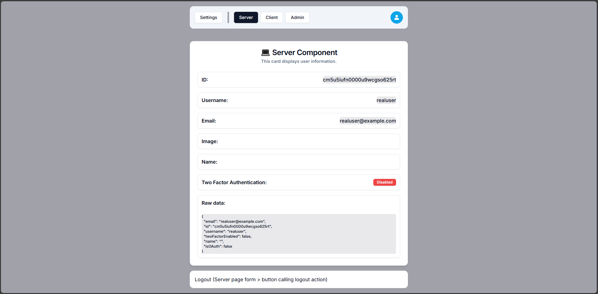

#### TR Readme [(Click for EN Readme)](https://github.com/gbpii/uno-auth/blob/84ff208b36ce81c4e966683b3d285c8bc7ce7c3f/docs/README.md)

# Next Auth - Fullstack AuthJS & NextJS

- NextJS uygulamana gelişmiş güvelik ve kimlik doğrulama ekle.
- Sadece "demo" seviyesinde olan proje için **main** branch kullan.
- Daha gelişmiş ve hataları giderilmiş seviyede olan proje için **src-structure** branch kullan.

## VSCode eklentileri

- Tailwind CSS
- vscode-icons
- Prisma
- simple react snippets
- Prettier ESLint (opsiyonel)
- Prettier - Code formatter (opsiyonel)
- Eslint (opsiyonel)
- Vue - Official (opsiyonel)
- One Dark Pro (opsiyonel)

## Gerekenleri yükleme ve çalıştırma

İlk olarak [Node.js] [node.js] (https://nodejs.org/) yüklü olmalı.

İkinci olarak bu repoyu klonla (veya forkla), ardından gerekli paketleri kur:

Çalıştır "npm i" (gerekli tüm paketleri yükler)

- tüm paketlerin listesi:

```
- npx shadcn@latest add card
- npx shadcn@latest add form
- npx shadcn@latest add input
- npx shadcn@latest add dropdown-menu
- npx shadcn@latest add avatar
- npx shadcn@latest add badge
- npx shadcn@latest add sonner
- npx shadcn@latest add dialog
- npm i react-icons
- npm i -D prisma
- npm i @prisma/client
- npm i @auth/prisma-adapter
- npm i bcrypt
- npm i -D @types/bcrypt
- npm i bcryptjs
- npm i -D @types/bcryptjs
- npm install next-auth@beta
- npm i uuid
- npm i --save-dev @types/uuid
- npm install resend
- npm i react-spinners
```

Proje içerisindeki `.env-example` dosyasının içeriğini gereken şekilde doldur ve dosya adıını `.env` olarak kaydet.

Çalıştır `npm run dev` (projeyi çalıştırmak için).

## Screenshots





## Original demo link:

**Code with Antonio** [Youtube Next Auth V5](https://www.youtube.com/watch?v=1MTyCvS05V4)

