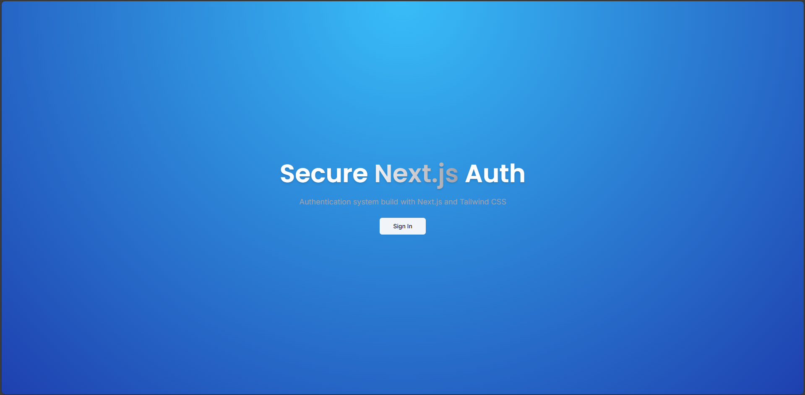
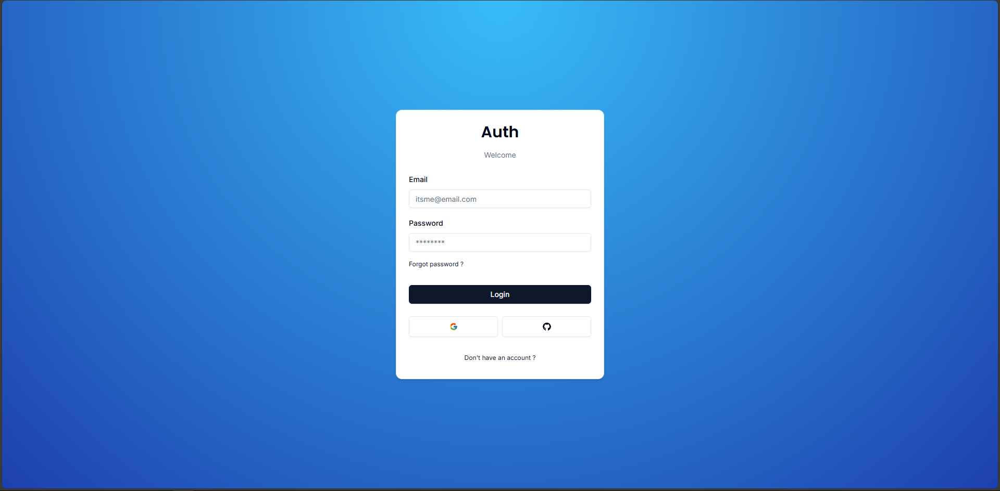
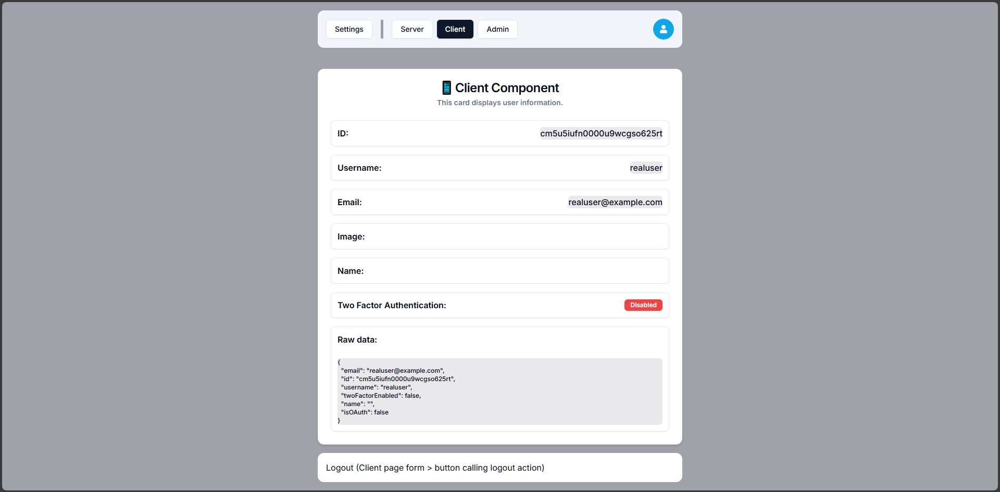

#### EN Readme [(TR Readme için Tıkla)](https://github.com/gbpii/uno-auth/blob/84ff208b36ce81c4e966683b3d285c8bc7ce7c3f/docs/README-TR.md)

# Next Auth - Fullstack AuthJS & NextJS

- Add advanced authentication to your NextJS App.
- Use **main** branch if you want only "demo" level project.
- Use **src-structure** if you want more features and fixed project.

## VSCode extenstions

- Tailwind CSS
- vscode-icons
- Prisma
- simple react snippets
- Prettier ESLint (optional)
- Prettier - Code formatter (optional)
- Eslint (optional)
- Vue - Official (optional)
- One Dark Pro (optional)

## Setup necessary things and run

First [Node.js] [node.js] (https://nodejs.org/) needed.

After setup Nodejs and cloning (or forking) repo, packages and libraries:

Run "npm i" (setups all packages)

- all packages list:

```
- npx shadcn@latest add card
- npx shadcn@latest add form
- npx shadcn@latest add input
- npx shadcn@latest add dropdown-menu
- npx shadcn@latest add avatar
- npx shadcn@latest add badge
- npx shadcn@latest add sonner
- npx shadcn@latest add dialog
- npm i react-icons
- npm i -D prisma
- npm i @prisma/client
- npm i @auth/prisma-adapter
- npm i bcrypt
- npm i -D @types/bcrypt
- npm i bcryptjs
- npm i -D @types/bcryptjs
- npm install next-auth@beta
- npm i uuid
- npm i --save-dev @types/uuid
- npm install resend
- npm i react-spinners
```

Fill all values inside `.env-example` and rename file to `.env`

Run `npm run dev` to run project.

## Screenshots








### Original demo link:


